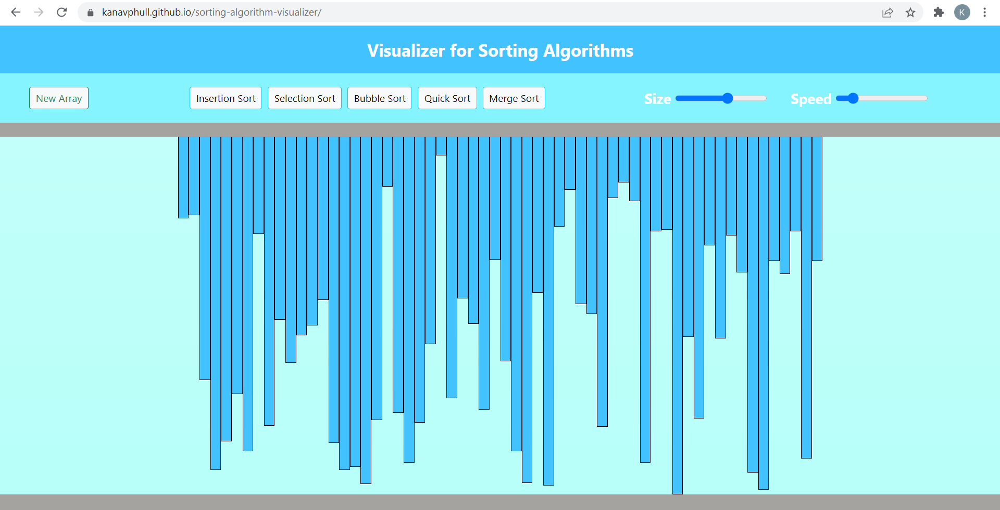
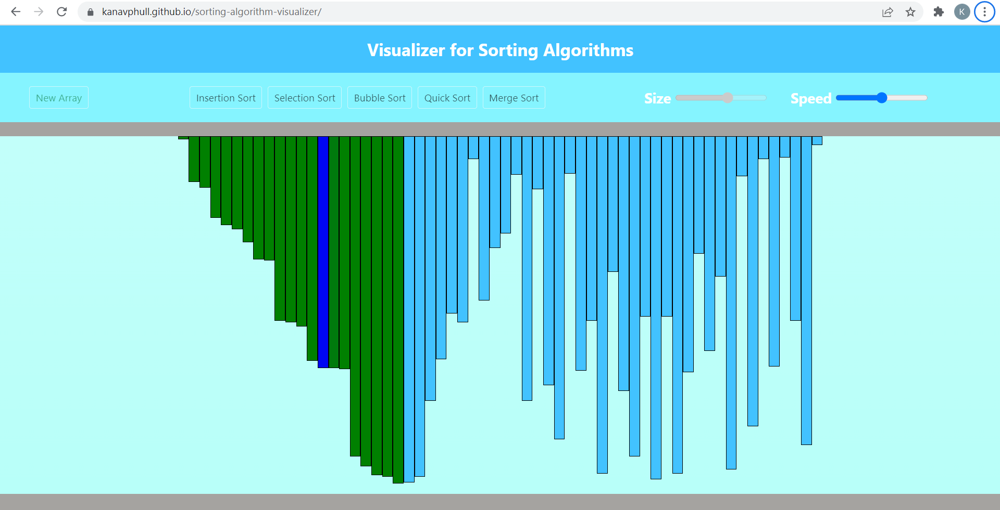
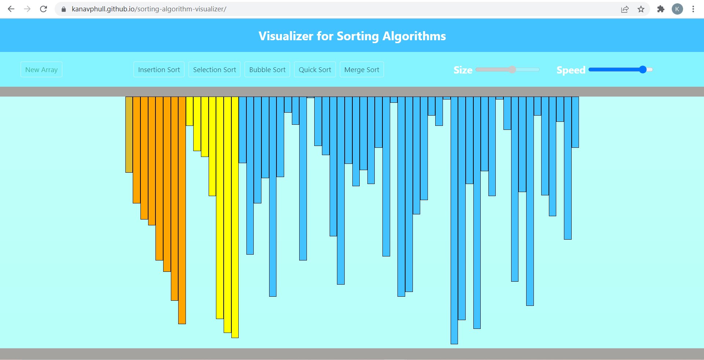

# This is Visualizer for normal sorting algorithms built using HTML, CSS, JS and Bootstrap

### This is Visualizer for normal sorting algorithms built using HTML, CSS, JS and Bootstrap
### The following sorts are visualized:
- Bubble Sort 
- Selection Sort
- Insertion Sort
- Quick Sort
- Merge Sort

[Click Here!](https://kanavphull.github.io/sorting-algorithm-visualizer/) to use the visualizer on the website.
## Screenshots
  
  
  